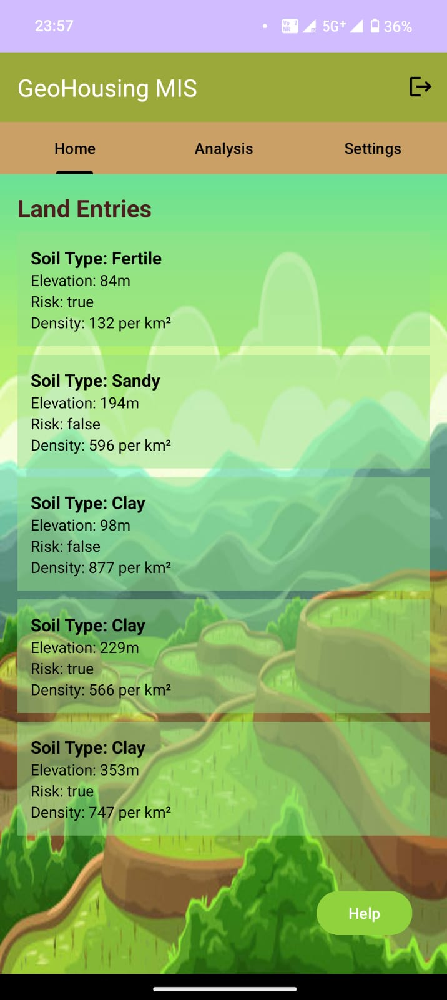
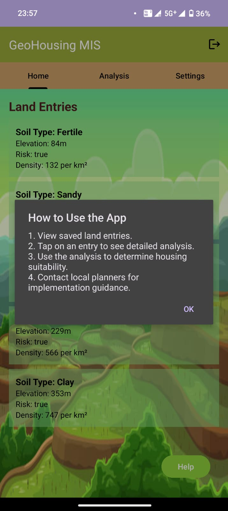

**GeoHousing MIS** is a mobile-based **decision support system** built for **rural housing development** and **land suitability analysis**. The application integrates **GIS concepts** with mobile technologies to help planners, administrators, and citizens assess land plots based on environmental and infrastructural parameters.

---

## 🏗️ Core Modules & Features

### 🏠 HomeFragment – Land Entry Overview
**Purpose:** Displays a dynamic list of land entries added by the user.

**Features:**
- Shows key land details: soil type, elevation, infrastructure access, population density, etc.
- Uses **RecyclerView** for efficient scrolling.
- Clicking on a land entry navigates to **AnalysisFragment** for detailed review.

**Preview:**

---

### ⚙️ SettingsFragment – Land Input & Preferences
**Purpose:** Allows entry of new land data and custom weight preferences for suitability analysis.

**Features:**
- Input fields for land parameters: soil quality, elevation, road access, utilities, risk zones.
- Custom **preference sliders** for factor weightage (e.g., infrastructure vs elevation).
- **SharedPreferences** used to save preferences persistently.

**Preview:**

---

### 📊 AnalysisFragment – Suitability Score & Visualization
**Purpose:** Analyzes and visualizes the suitability of selected land entries.

**Features:**
- Calculates a **weighted suitability score**.
- Displays a **PieChart** (via MPAndroidChart) showing factor contributions.
- Provides a score breakdown and actionable insights.

**Preview:**

---

## 🧠 Functional Workflow
1. User enters land details in **SettingsFragment**.
2. Data is saved locally and shown in **HomeFragment**.
3. User clicks a land entry → triggers **AnalysisFragment**.
4. Preferences retrieved from **SharedPreferences** → weighted score calculated.
5. Results visualized via **PieChart** with dynamic UI.

---

## 📊 Technical Details

| Component       | Description |
|-----------------|-------------|
| **Language**    | Kotlin |
| **UI Elements** | Fragments, RecyclerView, EditText, Buttons, PieChart, ScrollView |
| **Persistence** | SharedPreferences (for analysis weight preferences), Kotlin Data Classes for land entries |
| **Charting**    | MPAndroidChart |
| **Navigation**  | Fragment Navigation Component or FragmentManager transactions |
| **Data Transfer** | Serializable / Parcelable Data Classes |

---

## 📌 Advantages
- ✅ Personalized analysis using saved preferences  
- ✅ User-friendly interface for easy data entry  
- ✅ Effective visualization with charts  
- ✅ Offline-first approach for rural use  

---

## 🚀 Future Enhancements
- ☁️ **Cloud Integration:** Store land data and preferences on Firebase Firestore  
- 🗺️ **Map Integration:** Pinpoint land locations using Google Maps API  
- 🤖 **AI-Based Scoring:** Suggest optimal plots based on trends  
- 📄 **Reporting & Export:** Generate downloadable PDF reports  

---

## 📚 Conclusion
**GeoHousing MIS** is a lightweight, impactful mobile application that bridges **technology** with **rural development planning**. It empowers users to input, analyze, and visualize land data, making **informed, data-driven decisions** for sustainable housing development.

---

## 📸 Screenshots

  
  
  

---

## 📂 Project Structure
GeoHousing-MIS/
├─ app/
│ ├─ src/
│ │ ├─ main/
│ │ │ ├─ java/com/geohousing/
│ │ │ │ ├─ HomeFragment.kt
│ │ │ │ ├─ SettingsFragment.kt
│ │ │ │ ├─ AnalysisFragment.kt
│ │ │ │ ├─ models/
│ │ │ │ └─ utils/
│ │ │ └─ res/
│ │ │ ├─ layout/
│ │ │ ├─ drawable/
│ │ │ └─ values/
├─ build.gradle
└─ README.md

---

## 📌 Technologies Used
- **Kotlin**  
- **Android Jetpack Components**  
- **RecyclerView**  
- **SharedPreferences**  
- **MPAndroidChart**  

---

## ⚡ License
MIT License © 2025 GeoHousing Team

---

### ⭐ Show Your Support
If you find this project useful, give it a ⭐ on GitHub!

---

